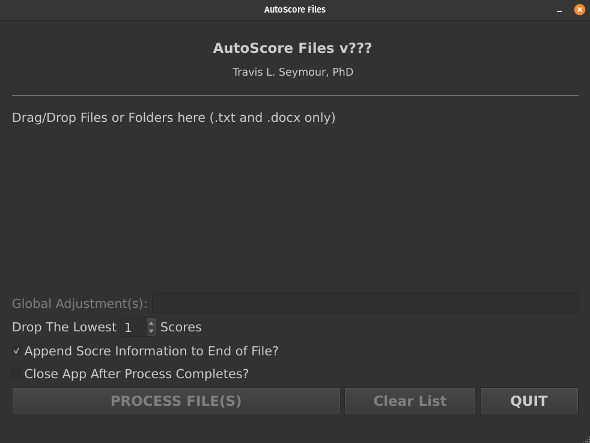

# AutoScore

Copyright © 2020-2025 Travis L. Seymour, PhD


Tool for grading text and word documents with bracketed scores indicated

---



---

AutoScore is a tool I use when grading essays or short-answer papers. When I grade each section, I add a bracketed score between 0-100. When I'm done, AutoScore creates a summary statement at the end of each document showing each score, any dropped scores, and the resulting average score. For example:

```
PAPER GRADE INFORMATION
    Source File: student_3013_Paper1.docx
    Number of Scores: 10
    Scores: 50|40|95|95|10|75|85|70|0|100
    Score Adjustments: Dropped lowest 1 scores.
    Other Adjustments:         
    Grade: 69%
```

It is designed to take a folder or list of Microsoft Word (.docx) files as input. It returns a new folder with copy of each input file with a summary appended at the bottom. It also creates a single Microsoft Excel (.xlsx) file listing each file name and the corresponding grade information.

| File | N | Scores | Mean | MeanAdj | Dropped |
|:---:|:---:|:---:|:---:|:---:|:---:|
| student_2050_Paper1.docx | 10 | 100\|100\|100\|100\|75\|100\|100\|100\|100\|100 | 98 | 100 | 1 |
| student_2970_Paper1.docx | 10 | 85\|90\|65\|95\|10\|60\|50\|50\|97\|85 | 69 | 75 | 1 |
| student_3013_Paper1.docx | 10 | 50\|40\|95\|95\|10\|75\|85\|70\|0\|100 | 62 | 69 | 1 |
| student_3294_Paper1.docx | 10 | 85\|95\|100\|100\|80\|100\|50\|50\|97\|100 | 86 | 90 | 1 |
| student_3400_Paper1.docx | 10 | 70\|90\|100\|100\|90\|65\|100\|100\|100\|100 | 92 | 94 | 1 |
| student_1604_Paper1.docx | 10 | 70\|98\|100\|85\|50\|70\|90\|85\|95\|85 | 83 | 86 | 1 |
| student_2515_Paper1.docx | 10 | 25\|80\|90\|75\|75\|60\|85\|95\|95\|50 | 73 | 78 | 1 |
| student_4907_Paper1.docx | 10 | 65\|50\|70\|65\|25\|40\|90\|75\|100\|65 | 64 | 69 | 1 |
| student_4026_Paper1.docx | 10 | 90\|95\|100\|95\|95\|98\|95\|100\|95\|100 | 96 | 97 | 1 |
| student_1290_Paper1.docx | 10 | 0\|33\|70\|0\|0\|25\|50\|33\|100\|50 | 36 | 40 | 1 |

I'm not sure if anyone else needs this, but I find it useful. Note that bracketed scores can also be simple equations. For example, this section might be work [87] points, whereas this section may be worth [25+45] points. This is nice if the section has multiple subsections and you want to communicate to the essay writer how the section score was broken down.

To add or subtract points on top of an individual's paper score, add bracketed numbers in the text, along with a label. E.g., if AutoScore finds {-10: late penalty}, it subtracts 10 from the final paper score and adds "-10: late penalty" to the grading summary. If AutoScore finds {+20|creative approach}, it adds 20 points to the final paper score and add "+20: creative approach" to the grading summary. E.g.:

```
PAPER GRADE INFORMATION
    Source File: student_9877_Paper1.docx
    Number of Scores: 10
    Scores: 100|100|100|100|75|100|100|100|100|100
    Score Adjustments: Dropped lowest 1 scores.
    Other Adjustments:        
    Manual Grade Adjustments:
        +20.0: creative approach
        -10.0: late penalty!
    Grade: 110%
```

NOTE: You can add a constant (positive or negative) to all paper scores in the UI.

Note: This project's code is released under the **GPLv3** license to comply with the requirements of PyQT5 library. I hope to convert this project to PySide6 shortly so that a less restrictive license can be used instead. If any files used here are missing the proper attribution, please let me know.
 The GPLv3 license has been included along with this program. If not, see <http://www.gnu.org/licenses/>.

---

## Installation Overview

To install AutoScore, I suggest you use `uv` (https://docs.astral.sh/uv/) on MacOS, Windows, and Linux. Although you can use a very similar set of commands to install AutoScore with `PipX` (https://pipx.pypa.io/latest/), I will describe how to do so using `uv` below.

## Install `uv`

You should install `uv` using the instructions at https://docs.astral.sh/uv/getting-started/installation/. However, the commands are simple and have been reproduced here for the most common use cases (though many other approaches are described for each platform on the `uv` installation webpage):

### MacOS & Linux

Use curl to download the script and execute it with sh:

```bash
curl -LsSf https://astral.sh/uv/install.sh | sh
```

### Windows

Use irm to download the script and execute it with iex:

```bash
powershell -ExecutionPolicy ByPass -c "irm https://astral.sh/uv/install.ps1 | iex"
```

## Install AutoScore

```bash
uv tool install git+https://github.com/travisseymour/autoscore.git
```


## Run AutoScore

Start AutoScore by opening your operating system's terminal application and type this command:

```bash
autoscore
```

---

## Upgrade AutoScore

Upgrade AutoScore by opening your operating system's terminal application and type this command:

```bash
uv tool upgrade autoscore
```

## Uninstall AutoScore

Uninstall AutoScore by opening your operating system's terminal application and type this command:

```bash
uv tool uninstall autoscore
```